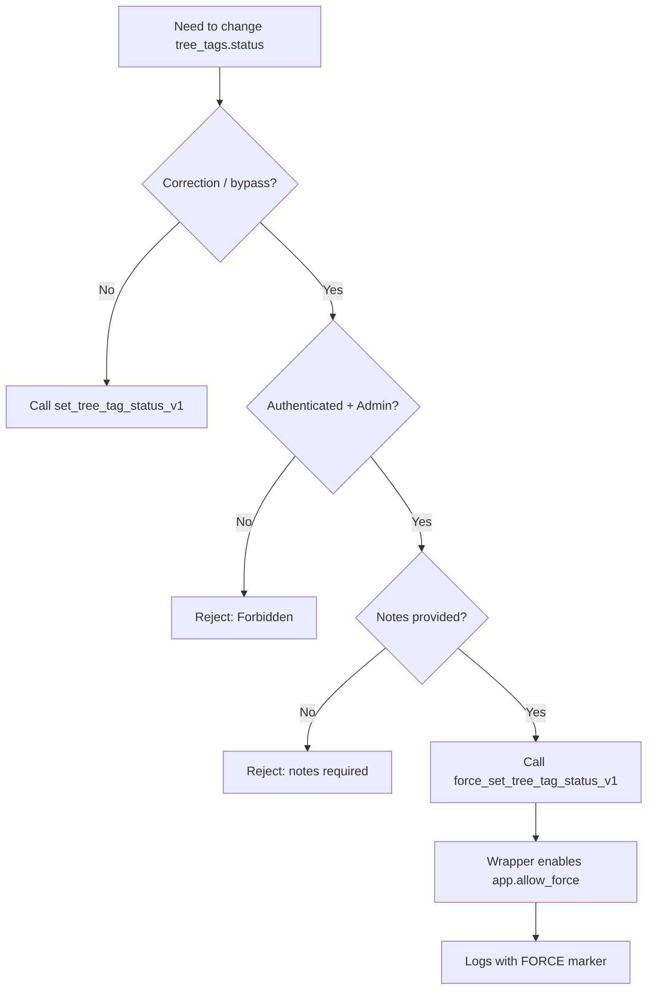

# Runbook: Tree Tag Status Update (Normal vs FORCE)

## Purpose

Standardize `public.tree_tags.status` updates:
- **Normal flow**: Enforce transition validation
- **FORCE flow**: Admin-only bypass with mandatory reason and audit trail

---

## Decision Rule

| Scenario | Function |
|---|---|
| Normal workflow transition | `set_tree_tag_status_v1` (p_force=false) |
| Correction / rescue / bypass | `force_set_tree_tag_status_v1` (wrapper) |
| Digup disposition correction | `force_apply_digup_disposition_v1` (wrapper) |



---

## FORCE Requirements

- **Authenticated user** (JWT present)
- **Admin allowlist** (hardcoded UUID)
- **Notes required** (reason for correction)

---

## Production Usage (Client)

### Normal

```ts
await supabase.rpc("set_tag_status_v2", {
  p_tag_id: tagId,
  p_to_status: "dug_hold",
  p_notes: "normal flow",
  p_source: "ui",
  p_changed_by: null
});
```

### FORCE (Correction)

```ts
await supabase.rpc("force_set_tree_tag_status_v1", {
  p_tag_id: tagId,
  p_to_status: "dug_hold",
  p_source: "ui",
  p_notes: "Correction: align with actual disposition"
});
```

---

## SQL Editor Testing (JWT Simulation)

> SQL Editor has no JWT context; `auth.uid()` is NULL. Simulate with `request.jwt.claims`:

### Setup Admin JWT

```sql
SELECT set_config(
  'request.jwt.claims',
  json_build_object(
    'sub', '36ee44ca-1dad-44a4-83dd-43646073f2c2',
    'role', 'authenticated',
    'email', 'admin@avafarm888.com'
  )::text,
  true
);
```

### Test FORCE Wrapper

```sql
SELECT public.force_set_tree_tag_status_v1(
  '912bebbc-8b66-429b-95b3-ce3040416d95'::uuid,
  'dug_hold'::text,
  'ui'::text,
  'Correction: test force wrapper'::text
);

RESET request.jwt.claims;
```

### Test Normal Flow

```sql
SELECT public.set_tree_tag_status_v1(
  '912bebbc-8b66-429b-95b3-ce3040416d95'::uuid,
  'dug_hold'::text,
  'manual_sql'::text,
  'normal flow'::text,
  false,
  '36ee44ca-1dad-44a4-83dd-43646073f2c2'::uuid
);
```

---

## Verification

### Check Current Status

```sql
SELECT id, status, updated_at
FROM public.tree_tags
WHERE id = 'TAG_UUID'::uuid;
```

### Check Timeline (Latest First)

```sql
SELECT *
FROM public.tree_tag_status_logs
WHERE tag_id = 'TAG_UUID'::uuid
ORDER BY changed_at DESC
LIMIT 20;
```

**FORCE markers**: notes contains `[FORCE]`

---

## Error Guide

| Error | Cause | Fix |
|---|---|---|
| `FORCE is disabled by app.allow_force` | Called `set_tree_tag_status_v1(p_force=true)` without gate | Use `force_set_tree_tag_status_v1` wrapper |
| `Not authenticated` | No JWT (SQL Editor / not logged in) | Set `request.jwt.claims` or log in |
| `Forbidden: FORCE requires admin` | User not in allowlist | Use admin account |
| `FORCE requires notes (reason)` | Empty/whitespace notes | Provide meaningful reason |

---

## Checklist (Quick Reference)

1. ✅ Normal work → `set_tree_tag_status_v1`
2. ✅ Correction → `force_set_tree_tag_status_v1` (never expose `app.allow_force` to UI)
3. ✅ FORCE requires reason (notes)
4. ✅ Check logs after every correction
5. ✅ SQL Editor → set `request.jwt.claims` first
